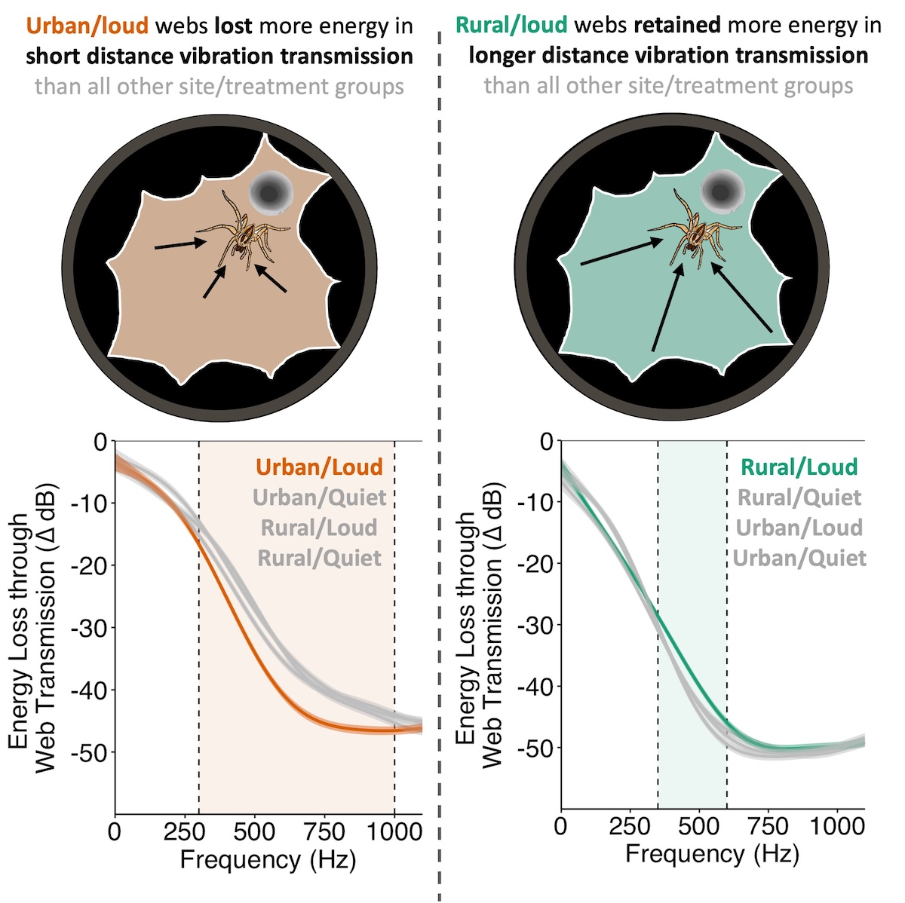

# Web transmission properties vary with a spider’s past and current noise exposure

The following data and code are provided as a reference for the associated publication in association in [Current Biology](https://doi.org/10.1111/eea.13487). This publication was written in association with my Ph.D. dissertation.

Access PDF: [View PDF](./Pessman_Hebets_2025.pdf)

## Who:

> > 👩 Authors: **Brandi Pessman** and Eileen Hebets

> > 🕷️ S️tudy Organism: *Agelenopsis pennsylvanica* (the funnel-weaving spider or grass spider)

## What:

> > Animals rely on the reception of accurate information for survival and reproduction. Environmental noise, especially from human activity, challenges information acquisition by disturbing sensory channels and masking relevant cues. Investigations into how animals cope with noise have been heavily biased toward plasticity in information production, often overlooking flexibility in information reception. Studying internal sensory structures and processes of information reception is challenging, but web-building spiders offer a unique opportunity to investigate an external sensory surface – their webs. Here, we explored the potential of the funnel-weaving spider, Agelenopsis pennsylvanica, to actively manipulate information reception amidst vibratory noise using its web. During web construction, we exposed spiders to a 2x2 fully crossed design: rural/urban collection sites and quiet/loud noise treatments, reflecting natural vibratory noise variation. On the resulting webs, we measured frequency-dependent energy loss as vibrations transmitted short and longer distances from an artificial stimulus to the spider’s hunting position. Under loud vibratory noise, rural webs reduced longer-distance energy loss in a narrow frequency range (350-600 Hz), potentially to improve the reception of prey and mate cues from across the web. In contrast, urban webs promoted short-distance energy loss across a broader frequency range (300-1000 Hz), likely to prevent sensory overload from constant, high-amplitude urban noise. Spiders appear to leverage prior noise exposure (ancestral and/or developmental) when responding to current noise levels. Our study highlights the capacity of animals to actively enhance information reception amidst environmental noise and emphasizes the importance of a holistic approach to studying information flow in dynamic environments.

The code presented in this repository walks through the analysis of this data, including:

-   Assigning spiders randomly to different treatments, matching age ([1_assign_treatments.Rmd](./1_assign_treatments.Rmd))

-   Wrangling/munging the data files ([2_data_wrangling.Rmd](./2_data_wrangling.Rmd)); as the data use a lot of storage space, this script additionally saves the wrangled data in *wrangled_data/* 

-   Using a Generalized Additive Model to assess the range of frequencies within known environmental noise are relevant to *A. pennsylvanica* foraging ([3_frequency_response.Rmd](./3_frequency_response.Rmd))

-   Running Generalized Additive Models to test whether vibrations travel differently across webs built by rural and urban spiders under different vibratory noise treatments ([4_vibration_transmission.Rmd](./4_vibration_transmission.Rmd))

## When:

> > 🕷 Spiders Collected: August 4-10, 2022; August 1-3, 2023

> > 🕸️ Data Collected: Vibration Transmission September 5-October 17, 2023

> > 📖 Date Submitted: December 6, 2024

> > 📖 Date Accepted: February 18, 2025

> > 📖 Date Published: March 14, 2025

## Where:

> > 📓 Data collected in: Lincoln, Nebraska

> > 📖 Data published in: *Current Biology*

## Why:

> > For a complete understanding of how animals may, or may not, cope with environmental noise, we must include how information is received and processed, an angle that is too often overlooked. The accurate reception of information is necessary for survival and reproduction, facilitating precise identification, evaluation, and localization of prey, threats, and mates. We unveil the first evidence that a spider that relies on its self-made web for vibratory information acquisition can control its vibration transmission in response to differing levels of noise in the vibratory channel. The observed plastic changes in this extended phenotype highlight the significant degree of inter-individual variation in the receiver’s ability to cope with noise that interferes with biologically relevant signals and cues. Moreover, a history of noise exposure, either during development or across generations, appears to further shape modifications in the web environment, as the distinct vibratory profiles of rural and urban habitats provided insights into the divergent responses from spiders’ webs. With the rise of intense and rapid changes to animal sensory landscapes brought on by anthropogenic noise, we advocate for future research to adopt a more holistic approach that is inclusive of information reception, hidden sensory channels like the vibratory channel, and previous exposure. We anticipate that this research will open doors for further investigation into the flexibility of receivers’ sensory systems.    

## How:

> > 💻 R programming language

Analyses include:

-   Generalized Additive Models ([3_frequency_response.Rmd](./3_frequency_response.Rmd), [4_vibration_transmission.Rmd](./4_vibration_transmission.Rmd))

> > 🎶️ Raven Pro Software for the analysis of vibrations

> > 🎶 Audacity and Matlab for stimulus production and filtering
